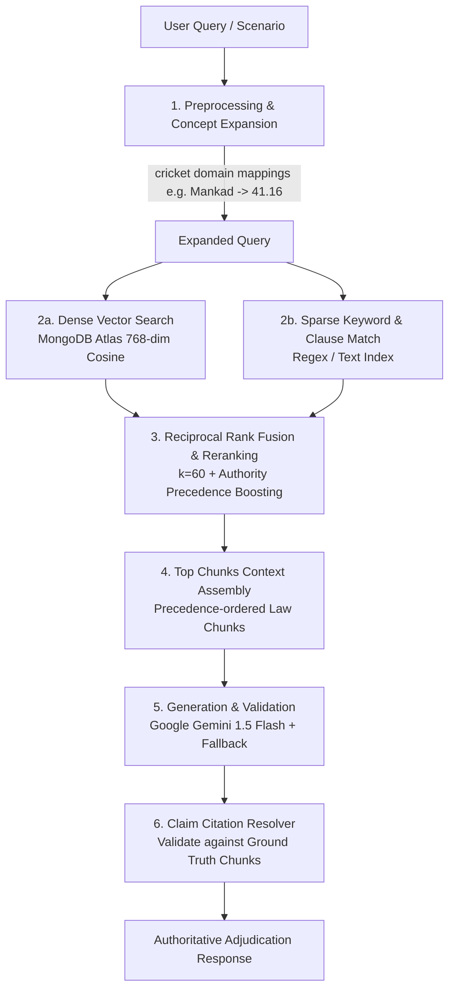

# 🏏 CricBot — AI Cricket Laws & Match Officiating Assistant

[](https://nodejs.org/)
[](https://www.python.org/)
[](https://react.dev/)
[](https://vitejs.dev/)
[](https://fastapi.tiangolo.com/)
[](https://expressjs.com/)
[](https://www.mongodb.com/products/platform/atlas-vector-search)
[](https://ai.google.dev/)
[](#-automated-testing--benchmark-suite)
[](LICENSE)

> **CricBot** is an authoritative, production-grade cricket legal reference and match adjudication platform. Powered by **Hybrid Retrieval-Augmented Generation (RAG)**, it is grounded strictly in official rulebooks: the **MCC Laws of Cricket (3rd Edition 2022)** and **ICC Standard Playing Conditions (Test, ODI, T20I, IPL)**.

---

## 📑 Table of Contents

- [The Problem \& Solution](#-the-problem--solution)
- [Key Features](#-key-features)
- [System Architecture](#-system-architecture)
- [Hybrid RAG Retrieval Pipeline](#-hybrid-rag-retrieval-pipeline)
- [Technology Stack](#-technology-stack)
- [Repository Layout](#-repository-layout)
- [Prerequisites \& System Requirements](#-prerequisites--system-requirements)
- [Environment Configuration](#-environment-configuration)
- [Quick Start \& Local Development](#-quick-start--local-development)
- [Document Ingestion \& Vector Indexing](#-document-ingestion--vector-indexing)
- [Automated Testing \& Benchmark Suite](#-automated-testing--benchmark-suite)
- [Production Deployment](#-production-deployment)
- [Statutory Discrepancy \& Bug Reporting](#-statutory-discrepancy--bug-reporting)
- [Author \& Acknowledgements](#-author--acknowledgements)

---

## 🎯 The Problem & Solution

Cricket is governed by one of the most intricate and nuanced rule systems in global sport. A single match incident often involves multiple interacting factors: ball deadness, player intent, pitch territory, bowler delivery mechanics, and boundary physics. 

Furthermore, cricket enforces **Hierarchical Authority Precedence**:
```
Specific Tournament Playing Conditions (e.g. IPL Playing Conditions)
   └── Supersedes: ICC Standard Playing Conditions (e.g. ICC Men's T20I / ODI / Test)
         └── Supersedes: The MCC Laws of Cricket (The Universal 42 Laws)
```

Traditional search engines and generic AI chatbots routinely hallucinate or apply universal MCC laws to situations governed by tournament-specific playing conditions (such as Powerplay rules, short-pitch limits, or DRS protocols).

### How CricBot Solves This
* **Strict Statutory Grounding**: Every answer is synthesized directly from verified chunks extracted from official PDFs.
* **Hierarchical Precedence Enforcement**: Filters and rerankers respect the tournament context to ensure the correct governing body's rule takes priority.
* **Claim-Level Citation Verification**: Citations are programmatically verified down to specific clause sub-paragraphs (e.g., `Law 28.3.1`, `ICC Men's T20I Cl. 41.6`).
* **Zero-Hallucination Safe Fallbacks**: If statutory evidence is insufficient to make a definitive ruling, CricBot explicitly declares the missing facts rather than guessing.

---

## ✨ Key Features

### 1. 🏛️ Official Adjudication Desk (Legal Chatbot)
- Natural language legal inquiry with verified rulings.
- Displays governing authority badge, formal ruling summary, precise law clause citations, verbatim clause text, and practical field implications.
- Competition-aware filtering across **MCC Laws**, **Test Matches**, **ODIs**, **T20Is**, and the **IPL**.
- Smart suggested follow-up queries for deeper adjudication.

### 2. ⚡ Multi-Event Match Scenario Analyser
- Breaks down complex, multi-stage match situations chronologically (e.g., *"Bowler bowls a waist-high full toss; striker hits it into the ground, non-striker starts running, wicketkeeper picks it up wearing illegal equipment and breaks the wicket"*).
- Outputs a structured breakdown:
  - **Sequential Timeline of Events**
  - **Applicable Statutes & Governing Precedence**
  - **Umpire Field Action & Decision Matrix**
  - **Penalty Runs, Runs Scored & Ball Deadness Assessment**
  - **Missing Facts / Edge-Case Disclaimers**

### 3. 📖 Statutory Codex & Clause Search
- Instant, high-speed search across all 42 MCC Laws and ICC Playing Conditions.
- Filter by clause number, keyword, match format, and issuing authority.
- Deep-linkable modals showing full statutory text, edition year, and related clauses.

### 4. 🎓 Umpire Assessment & Examination Suite
- Server-scored officiating examinations divided into **Associate / Foundation**, **National Panel**, and **Elite First-Class** difficulty tiers.
- Immediate evaluation with clause-by-clause rationale, citation breakdown, and scoring summary.

### 5. 🛡️ Statutory Discrepancy & Bug Reporting System
- Dedicated modal for match officials, players, and developers to report incorrect law interpretations or technical bugs.
- **Direct Gmail Web Integration**: Opens pre-formatted, pre-addressed email drafts (`saikrishnabathina999@gmail.com`) with full technical context in one click.
- **Audit Logging**: Persists reports to MongoDB with optional SMTP notification dispatch.

### 6. 📂 Administrator Document Codex Management
- Ingestion management interface displaying registered PDF rulebooks, chunk count, publication dates, and index statuses.

---

## 🏗️ System Architecture

CricBot is built as a modular 3-tier microservice architecture:

```
┌────────────────────────────────────────────────────────────────────────┐
│                        Client Tier (Vercel)                            │
│  React 18 + Vite SPA                                                   │
│  - Adjudication Desk, Scenario Analyser, Codex Search, Quiz Engine     │
│  - Tailwind CSS (Refined MCC Forest Green & Pale Mint Palette)         │
│  - Code-split vendor bundle + SPA Direct Rewrites                      │
└───────────────────────────────────┬────────────────────────────────────┘
                                    │ HTTPS / REST (JSON)
                                    ▼
┌────────────────────────────────────────────────────────────────────────┐
│                   Express API Gateway (Render)                         │
│  Node.js 20+ / Express 4 (Port 5000)                                   │
│  - Session & Conversation Management                                   │
│  - Authentication (JWT), Rate Limiting & Helmet Security               │
│  - Discrepancy Report Tracking & Email Dispatch                        │
│  - Python RAG Microservice Client & Fallback Engine                    │
└───────────────────┬────────────────────────────────┬───────────────────┘
                    │                                │ Internal HTTP (JSON)
                    ▼                                ▼
┌──────────────────────────────────────┐ ┌───────────────────────────────┐
│        Data Tier (MongoDB)           │ │   Python RAG Service (Render) │
│  MongoDB Atlas Cluster (v7.0+)       │ │  Python 3.11 / FastAPI        │
│  - Collections:                      │ │  - PyMuPDF PDF Parsing        │
│    • documentchunks (768-dim vector) │ │  - Hybrid Vector + BM25 RRF   │
│    • documents                       │ │  - Domain Concept Expansion   │
│    • conversations & messages        │ │  - Gemini LLM Answer Service  │
│    • reports & audit logs            │ │  - Strict Citation Resolver   │
│  - Atlas Vector Search Index         │ └───────────────────────────────┘
└──────────────────────────────────────┘
```

---

## 🔍 Hybrid RAG Retrieval Pipeline

The Python RAG microservice utilizes a 5-stage retrieval and generation pipeline designed specifically for legal texts:



1. **Preprocessing & Concept Expansion**: Recognizes colloquial cricket terms (e.g. *"Mankad"*, *"beamer"*, *"free hit"*, *"hit the roof"*) and maps them to statutory clauses (e.g. Law 41.16, Law 41.7, Law 28.3).
2. **Dense Vector Search**: Queries the 768-dimensional embeddings stored in MongoDB Atlas via vector cosine similarity.
3. **Sparse Keyword & Exact Clause Matching**: Direct matching against clause numbers (`Law 37.1.1`, `Cl. 41.3`) ensuring exact legal clauses are never missed.
4. **Reciprocal Rank Fusion (RRF)**: Combines dense and sparse results using $RRF(d) = \sum \frac{1}{60 + r_i(d)}$, weighted with tournament precedence rules.
5. **Prompt-Grounded Generation**: Feeds verified statutory chunks into Google Gemini 1.5 with strict prompt rules prohibiting unsupported statements.
6. **Citation Post-Validation**: Inspects generated citations against source chunk database IDs to eliminate fictitious clause numbers.

---

## 🛠️ Technology Stack

| Layer | Technologies | Purpose |
| :--- | :--- | :--- |
| **Frontend** | React 18, Vite 5, Tailwind CSS, React Router 6, Lucide Icons | Responsive SPA, minimal legal-reference UI |
| **API Gateway** | Node.js 20+, Express 4, Mongoose 8, Zod, JWT, Helmet, Express Rate Limit | REST routing, auth, rate-limiting, persistence |
| **RAG Microservice** | Python 3.11, FastAPI, Uvicorn, Motor, PyMuPDF (fitz) | Vector orchestration, PDF parsing, hybrid search |
| **LLM & Embeddings** | Google Gemini 1.5 Flash / Pro, Sentence-Transformers | Question answering, reasoning, dense embeddings |
| **Database** | MongoDB Atlas v7.0+, Atlas Vector Search | Document store, vector index, conversations |
| **Testing** | Vitest, Supertest, Pytest | End-to-end integration, RAG quality benchmarks |
| **DevOps & Cloud** | Vercel (Client), Render (API & RAG), Git | Zero-downtime hosting, CI/CD, Blueprint deployments |

---

## 📁 Repository Layout

```
CricBot/
├── client/                               # Frontend React 18 Application
│   ├── public/
│   │   └── _redirects                    # Netlify/Render static SPA rewrite rule
│   ├── src/
│   │   ├── components/                   # UI components (Navbar, Sidebar, Modals, Footer)
│   │   │   ├── citations/                # Citation breakdown & modal viewer
│   │   │   ├── feedback/                 # ReportDiscrepancyModal (Gmail Web integration)
│   │   │   └── layout/                   # Layout wrappers and navigation
│   │   ├── pages/                        # Route pages (Chat, Scenario, Search, Quiz, Admin)
│   │   ├── services/                     # API client utilities (Axios)
│   │   └── index.css                     # Tailwind design system & MCC color tokens
│   ├── vercel.json                       # Vercel SPA routing configuration
│   ├── vite.config.js                    # Code-splitting & manual vendor chunks config
│   └── package.json
│
├── server/                               # Node.js Express API Gateway
│   ├── src/
│   │   ├── config/                       # Database, CORS & environment loaders
│   │   ├── controllers/                  # Chat, Scenario, Quiz, Report & Document controllers
│   │   ├── middleware/                   # JWT Auth, Rate Limiter, Error Handler, Validator
│   │   ├── models/                       # Mongoose schemas (DocumentChunk, Message, Report, User)
│   │   ├── routes/                       # Express v1 API routes
│   │   └── services/                     # RAG orchestrator, Python client, Email dispatcher
│   ├── tests/
│   │   └── integration/                  # Vitest integration suites (API, Reports, Evaluation)
│   ├── vitest.config.js                  # Vitest configuration & timeouts
│   └── package.json
│
├── rag-service/                          # Python FastAPI RAG Microservice
│   ├── app/
│   │   ├── api/                          # FastAPI endpoints (/retrieve, /answer, /health)
│   │   ├── citations/                    # Citation parsing, validation & schemas
│   │   ├── core/                         # Configuration, logging & exception handling
│   │   ├── db/                           # MongoDB Motor connection & chunk repositories
│   │   ├── embeddings/                   # Embedding providers (Local 768-dim / Gemini)
│   │   ├── generation/                   # Gemini client, answer service & statutory prompts
│   │   ├── ingestion/                    # PyMuPDF extractor, law parser, chunker & CLI
│   │   ├── retrieval/                    # Hybrid fusion, filters, reranker & retriever
│   │   └── main.py                       # FastAPI application entrypoint
│   ├── scripts/                          # Verification, inspection & testing utilities
│   ├── tests/                            # Pytest test suite (12 tests)
│   └── requirements.txt                  # Python production dependencies
│
├── knowledge-base/                       # Statutory Source Material
│   ├── incoming/                         # Official PDF rulebooks (MCC, ICC ODI, T20I, Test, IPL)
│   ├── approved/                         # Ingested and verified documents
│   └── manifests/                        # Source authority tracking manifests
│
├── docs/                                 # Technical architecture, schemas, and RAG evaluation docs
├── DEPLOYMENT.md                         # Complete 8-section production operations runbook
├── render.yaml                           # 1-Click Render Blueprint specification
├── start.bat                             # Windows 1-click batch launcher
├── start.ps1                             # PowerShell 1-click concurrent launcher
└── README.md                             # Project documentation
```

---

## 📦 Prerequisites & System Requirements

| Tool | Minimum Version | Recommended Version |
| :--- | :--- | :--- |
| **Node.js** | `v20.0.0` | `v22.x LTS` |
| **npm** | `v10.0.0` | `v10.x` |
| **Python** | `v3.11.0` | `v3.11.9` |
| **MongoDB Atlas** | `v7.0+` | Atlas M0 Free or M10+ with Vector Search enabled |
| **Google Gemini API Key** | — | Valid key from [Google AI Studio](https://aistudio.google.com/) |

---

## ⚙️ Environment Configuration

### 1. Frontend (`client/.env`)
```ini
# Base URL pointing to the Express backend API
VITE_API_BASE_URL=http://localhost:5000/api/v1
```

### 2. Express Backend (`server/.env`)
```ini
NODE_ENV=development
PORT=5000

# Client domain for CORS validation
CLIENT_URL=http://localhost:5173
ALLOWED_ORIGINS=http://localhost:5173,http://localhost:3000

# MongoDB Atlas connection string
MONGODB_URI=mongodb+srv://<user>:<password>@cluster.mongodb.net/cricket_laws?retryWrites=true&w=majority

# Authentication
JWT_SECRET=your_super_secret_jwt_key_at_least_32_characters_long
JWT_EXPIRES_IN=7d

# LLM Configuration
LLM_PROVIDER=gemini
LLM_API_KEY=AIzaSy...
LLM_MODEL=gemini-1.5-flash

# Python RAG Microservice connection
USE_PYTHON_RAG=true
PYTHON_RAG_SERVICE_URL=http://127.0.0.1:8000

# Statutory Discrepancy & Bug Reporting
DEVELOPER_EMAIL=saikrishnabathina999@gmail.com
```

### 3. Python RAG Microservice (`rag-service/.env`)
```ini
ENVIRONMENT=development
PORT=8000
HOST=127.0.0.1
ALLOWED_ORIGINS=*

# MongoDB Atlas (Same cluster as backend)
MONGODB_URI=mongodb+srv://<user>:<password>@cluster.mongodb.net/?retryWrites=true&w=majority
MONGODB_DB_NAME=cricket_laws
VECTOR_INDEX_NAME=cricket_vector_index

# Google Gemini API
GEMINI_API_KEY=AIzaSy...
LLM_MODEL=gemini-1.5-flash
EMBEDDING_PROVIDER=local
```

---

## 🚀 Quick Start & Local Development

### Option A: One-Click Launch (Windows)

Launch all three services simultaneously in dedicated terminal windows:
```powershell
.\start.ps1
```
*(Or double-click `start.bat` in File Explorer).*

---

### Option B: Manual Multi-Terminal Setup

#### 1. Start Python RAG Service
```powershell
cd rag-service
python -m venv .venv
.\.venv\Scripts\Activate.ps1
pip install -r requirements.txt
python -m uvicorn app.main:app --host 127.0.0.1 --port 8000 --reload
```
*Health verification*: [`http://127.0.0.1:8000/health`](http://127.0.0.1:8000/health)

#### 2. Start Express API Gateway
```powershell
cd server
npm install
npm run dev
```
*Health verification*: [`http://localhost:5000/api/v1/health/ready`](http://localhost:5000/api/v1/health/ready)

#### 3. Start React Frontend
```powershell
cd client
npm install
npm run dev
```
*Open application in browser*: **[`http://localhost:5173`](http://localhost:5173)**

---

## 📚 Document Ingestion & Vector Indexing

To ingest official cricket rulebooks into your MongoDB Atlas vector store:

1. **Place source PDFs** in `knowledge-base/incoming/`:
   - `mcc_laws_of_cricket.pdf`
   - `icc_mens_t20i_playing_conditions.pdf`
   - `icc_mens_odi_playing_conditions.pdf`
   - `icc_mens_test_playing_conditions.pdf`
   - `ipl_match_playing_conditions.pdf`

2. **Execute Ingestion CLI**:
   ```powershell
   cd rag-service
   python -m app.ingestion.cli --all
   ```
   The ingestion CLI:
   - Extracts structured text using PyMuPDF while filtering out frontmatter, tables of contents, and ads.
   - Parses hierarchy: `Part` → `Law` → `Section` → `Clause` → `Sub-clause`.
   - Generates 768-dimensional embeddings for each statutory chunk.
   - Upserts chunks to `cricket_laws.documentchunks` with deterministic deduplication hashes.

3. **Configure Atlas Vector Search Index**:
   In **MongoDB Atlas** → **Atlas Search** → **Create Search Index** (JSON Editor):
   - Collection: `cricket_laws.documentchunks`
   - Index Name: `cricket_vector_index`
   - Definition:
     ```json
     {
       "fields": [
         {
           "type": "vector",
           "path": "embedding",
           "numDimensions": 768,
           "similarity": "cosine"
         },
         { "type": "filter", "path": "lawNumber" },
         { "type": "filter", "path": "applicableFormat" },
         { "type": "filter", "path": "source.issuingOrganisation" }
       ]
     }
     ```

---

## 🧪 Automated Testing & Benchmark Suite

The codebase enforces strict test-driven reliability across all services:

```powershell
# 1. Run Node.js Backend Integration & Retrieval Benchmark Tests
cd server
npm test

# Results: 7 test files, 19 tests ALL PASSING
# Includes 100% Recall@5 and 0.929 MRR benchmark on official test queries
```

```powershell
# 2. Run Python RAG Microservice Tests
cd rag-service
pytest -v

# Results: 12 tests ALL PASSING across chunking, citation validation,
# health probes, PDF parsing, and reciprocal rank fusion
```

```powershell
# 3. Verify Client Production Build & Bundle Optimization
cd client
npm run build

# Results: 0 errors; code-split into index (121 kB), vendor (140 kB), and axios (29 kB)
```

---

## 🌐 Production Deployment

CricBot is pre-configured for production hosting:

| Component | Target Provider | Configuration File |
| :--- | :--- | :--- |
| **Frontend SPA** | **Vercel** / Netlify | [`client/vercel.json`](client/vercel.json), [`client/public/_redirects`](client/public/_redirects) |
| **Backend API** | **Render** Web Service | [`render.yaml`](render.yaml) (`cricbot-api`) |
| **Python RAG** | **Render** Web Service | [`render.yaml`](render.yaml) (`cricbot-rag`), [`rag-service/requirements.txt`](rag-service/requirements.txt) |
| **Database** | **MongoDB Atlas** | Network IP `0.0.0.0/0`, Search Index `cricket_vector_index` |

For step-by-step instructions, environment variable setup, rollback procedures, and post-deployment verification tests, see the [Production Deployment Runbook (DEPLOYMENT.md)](DEPLOYMENT.md).

---

## 🐞 Statutory Discrepancy & Bug Reporting

Ensuring 100% legal precision is critical for match officiating. If you encounter an inaccurate clause interpretation, a missing condition, or an application bug:

1. Click **"Report Law / Bug"** in the top navigation bar of the application.
2. Fill in the category, description, and proposed correction.
3. Click **"Send via Gmail (Web)"** — this opens a pre-populated email draft addressed directly to the maintainer (`saikrishnabathina999@gmail.com`) with full context attached.
4. You may also submit directly through the form to persist the issue in the administrator review audit log.

---

## 👤 Author & Acknowledgements

- **Lead Developer**: **Sai Krishna Bathina** ([saikrishnabathina999@gmail.com](mailto:saikrishnabathina999@gmail.com))
- **Statutory Source Authority**: 
  - **Marylebone Cricket Club (MCC)** — The official custodians of the *Laws of Cricket*.
  - **International Cricket Council (ICC)** — Standard Playing Conditions for Test, ODI, and T20I matches.
  - **Board of Control for Cricket in India (BCCI)** — Indian Premier League (IPL) Match Playing Conditions.

---

*This software is developed for educational, reference, and match-officiating assistance purposes. For official international matches, rulings remain subject to the ultimate authority of the appointed on-field and TV umpires.*
